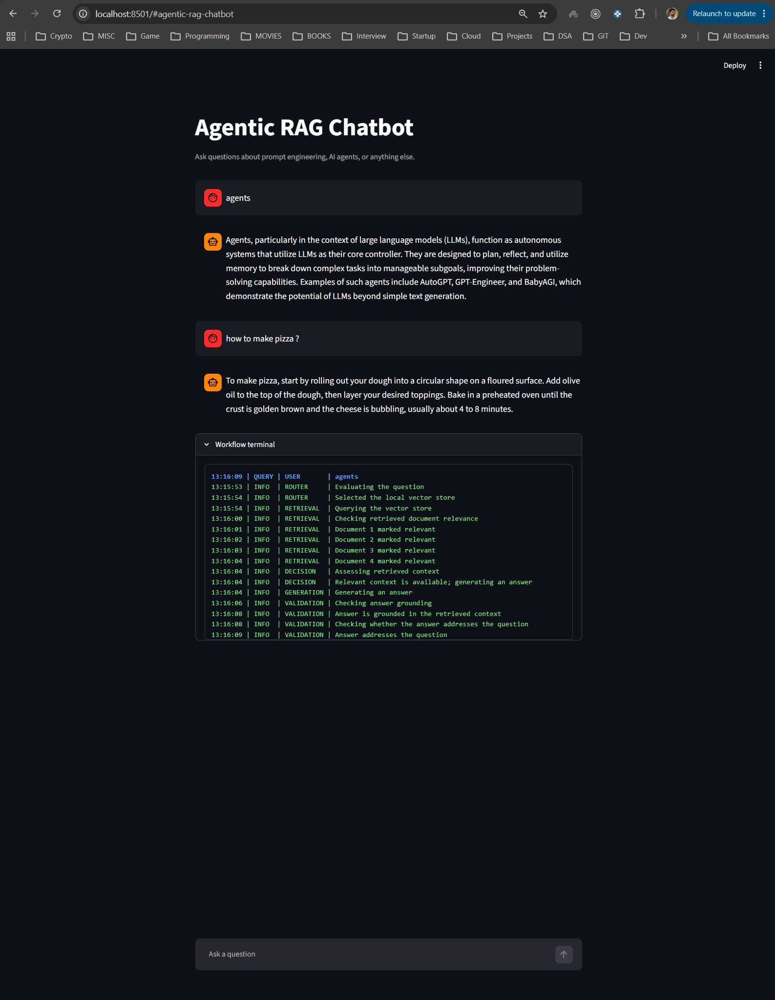
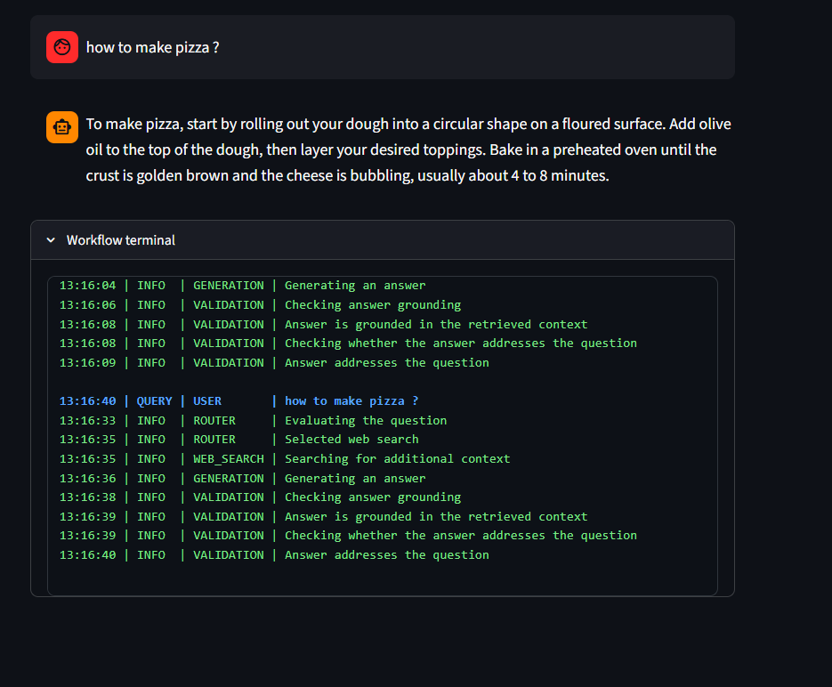

# Agentic RAG with LangGraph

Implementation of Advanced RAG techniques like Reflective RAG, Self-RAG & Adaptive RAG 


This application works as a RAG and chatbot. Currently this application context is based on the below urls. And if the user asks any questions out of context the the query is routed to web search instead of document retrival.

```bash
URLS = [
    "https://lilianweng.github.io/posts/2023-06-23-agent/",
    "https://lilianweng.github.io/posts/2023-03-15-prompt-engineering/",
]
```





## Features


- Agentic RAG Implementation
- Graph-Based Control Flow
- Document Relevance Evaluation
- Adaptive Information Retrieval
- State Management


## Environment Variables

To run this project, you will need to add the following environment variables to your .env file:

```bash
OPENAI_API_KEY=your_openai_api_key_here
TAVILY_API_KEY=your_tavily_api_key_here  # For web search capabilities
LANGCHAIN_API_KEY=your_langchain_api_key_here  # Optional, for tracing
LANGCHAIN_TRACING_V2=true                      # Optional
LANGCHAIN_PROJECT=agentic-rag                  # Optional
```


## Getting Started

Clone the repository:


Install dependencies:

```bash
pip install -r requirements.txt
```


Start the Agentic Rag flow

```bash
  uv run uvicorn backend.main:app --reload
```

In a second terminal, start the Streamlit frontend:

```bash
  uv run streamlit run frontend/app.py
```

The frontend connects to `http://127.0.0.1:8000` by default. Set the
`BACKEND_URL` environment variable when the backend is deployed elsewhere.


## Note

Deployment is not possible with free plans as we are using chroma and it requires paid plan.